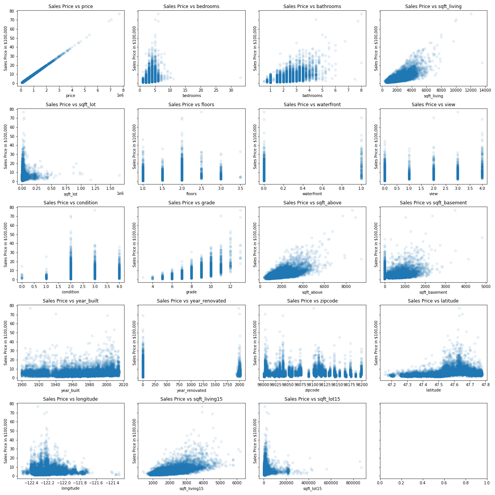
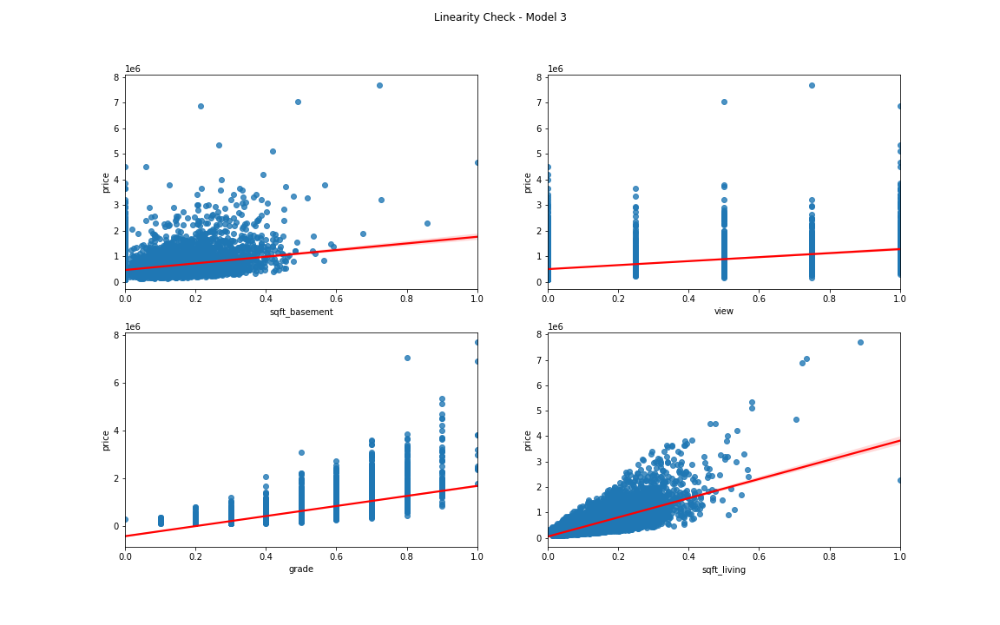

# King County Housing Data Anaylsis 

Author: Simran Kaur


## Problem

A local real estate agency in Kings County, Washington wants to know which variables bring the most value to a house. They want to use this information to help their clients increase the value of their homes. 

This analysis will create a multi regression model that can be used to determine which features of a house add the most value to it. 

## Data

Data was be taken from the King County Housing dataset; it contains information on the size, location, condition, and other features of houses in King County, Washington. 

## Methods

The first step in this process was Explanatory Data Analysis (EDA). This was split into two parts; the first part was focused on cleaning the data and the second part analyzed all of the features in the dataset. This included distinguishing between categorical, discrete and continuous features and visually plotting them. Price was finalized as the dependent value and an analysis was done on the relationships each variable held to price.

The second step in this process was running models using OLS. Three different combinations of features were assessed and the model with the highest R-squared was chosen. That model was then tested against the four assumptions of linear regression and validated by a train-test split.

## Results

The scatterplots below were ran before model creation and they show the relationship a feature has with price. These plots were used as guide to input features into the model.



After the models were ran and one was finalized, it was concluded that grade, view, square footage of the home and square footage of the basement are the features that add the most value to a home. 



The chosen model has an R-squared value of 0.575, which means that the relationship between the independent and dependent variables explain 57.5% of the variance in the data. All p-values were below 0.05.

## Recommendations

Homeowners who want to sell their homes should focus on increasing the footage and improving the grade of the house. They can increase the footage of their homes by building rooms. They can increase their grade by referencing the benchmark Kings County uses to apply a grade to a home.  

## Next Steps

The finalized model did not pass the linearity checks. It would be worthwhile to remove the outliers for some features, create new variables by feature engineering and long-transforming the existing features. The OLS model should be ran again at that point. 

## Further Information

See the full analysis in the Jupyter Notebook or review this presentation.

For additional information, contact Simran Kaur at simran.kaur@flatironschool.com

## Repository Structure
```
├── Images
│   ├── Genres_With_the_Highest_ROI.png
│   ├── Movie_Releases_Per_Year.png
│   ├── Movie_Runtimes.png
├── zippedData
├── student.ipynb
├── presentation.pdf
└── README.md