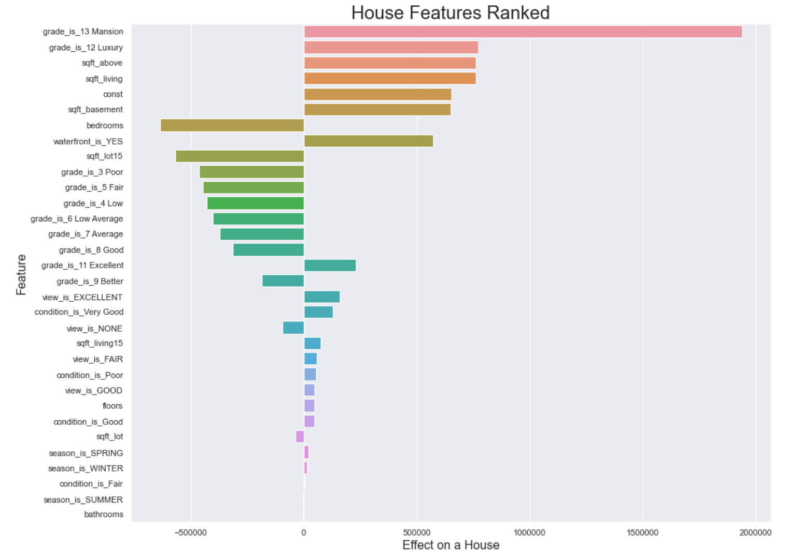

# King County Housing Data Anaylsis 

Author: Simran Kaur


## Problem

The client is a group of investors that would like to buy houses in King County, Washington. They want to understand what features are indicators of a good investment.

This analysis will create a couple regression models that can be used to determine which features of a house add the most value and thus, making them good investments.

## Data

Data was taken from the King County Housing dataset; it contains information on the size, location, condition, and other features of houses in King County, Washington. 

## Methods

The first step in this process was Explanatory Data Analysis (EDA). This was split into two parts; the first part was focused on cleaning the data and the second part analyzed all of the features in the dataset. This included distinguishing between categorical, discrete and continuous features and visually plotting them. Price was finalized as the dependent variable and an analysis was done on the relationships each variable holds to price.

The second step in this process was running models using OLS. Three different models were ran.
* The first model was ran with only squarefoot_living as it shared the strongest relationship with price. This was the baseline model.
* The second model was ran with squarefoot_living and squarefoot_lot. Squarefoot_lot was chosen because it shares a rather weaker relationship with both price and squarefoot_living. 
* The third model had all of the features from the cleaned up dataset. 

The finalized model was then validated by a train-test split and tested against the four assumptions of linear regression.

## Results

The third OLS model was chosen as the final model as it yielded the highest R-squared value. The model explained 64.9% of the variance in the data. A train-test split was ran on the model and it was concluded that the model was overfitted. The model was also tested against the four linear assumptions and it did not pass all of the checks.

The below chart was plotted to show which features have the greater influence on price.



## Recommendations

1. Grade has a high impact on the cost of a house. It would be best to invest in homes with a grade of at least an 10. 
2. Square footage of the area above ground and the living area are also strong determinants when it comes to the price of a home. Greater footage in both of those features would be a good investment.
3. Houses with an excellent view also good investments.

## Next Steps

The finalized model did not pass the linearity checks. It would be worthwhile to remove the outliers for some features and rerun the model with a smaller group of features.

## Further Information

See the full analysis in the [Jupyter Notebook](https://github.com/simrank3/phase2-project/blob/main/student.ipynb) or review this [presentation](https://github.com/simrank3/phase2-project/blob/main/presentation.pdf).

For additional information, contact Simran Kaur at simran.kaur@flatironschool.com

## Repository Structure
```
├── data
├── images
│   ├── all_features_pairplots.jpeg
│   ├── features_ranked.jpeg
│   ├── kc_wa.jpeg
├── student.ipynb
├── presentation.pdf
└── README.md